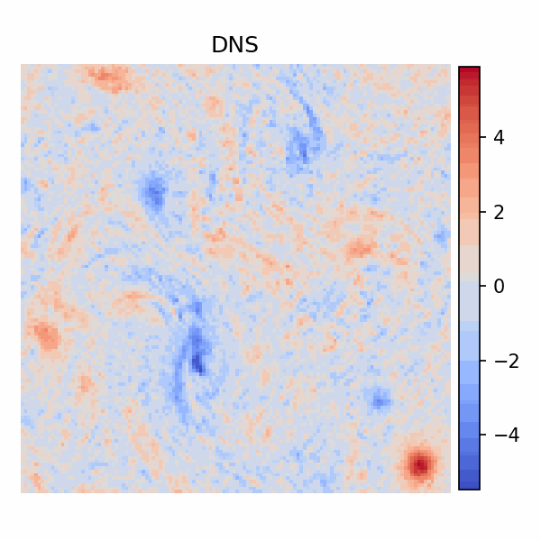

# ConvLSTM-based 2-D Turbulence Prediction  
Autoregressive rollout with optional Scheduled Sampling

  

## Overview
This repository contains three TensorFlow 2.x training scripts for predicting future vorticity fields in 2-D decaying turbulence:

| Script |  ε-schedule | Start ε (epoch 10) | Comment |
| ------ | ---------- | ------------------ | ------- |
| `modelTF.py` | None | — | Teacher-forcing only |
| `model09.py` | linear/exp decay | 0.90 at 10e | Gentle sampling |
| `model08.py` | linear/exp decay | 0.80 at 10e | Aggressive sampling |

All models share the same lightweight **ConvLSTM → BN → Conv** backbone and roll out **5 frames** autoregressively from **3 input frames**.

---

## Dataset
> 50 initial random velocity field cases
> 6.283 x 6.283 (128 x 128) vorticity field
> using 40.0~49.9(100 frames of each cases)
> Rotaition(90, 180, 270) for data augmentation
> Normalization: w/w'_0 (w'_0: rms of first voriticity frame of each case)

---

## References
(1) Kraichnan, R. H., & Montgomery, D., 1980, Two-dimensional turbulence. Reports on Progress in Physics, 43(5), 547.
(2) Shi, X., Chen, Z., Wang, H., Yeung, D. Y., Wong, W. K., & Woo, W. C., 2015, Convolutional LSTM network: A machine learning approach for precipitation nowcasting. Advances in neural information processing systems, 28.
(3) Liu, C., 2025, Convolutional Long Short-Term Memory Neural Networks Based Numerical Simulation of Flow Field.
(4) Bengio, S., Vinyals, O., Jaitly, N., & Shazeer, N., 2015, Scheduled sampling for sequence prediction with recurrent neural networks. Advances in neural information processing systems, 28.
